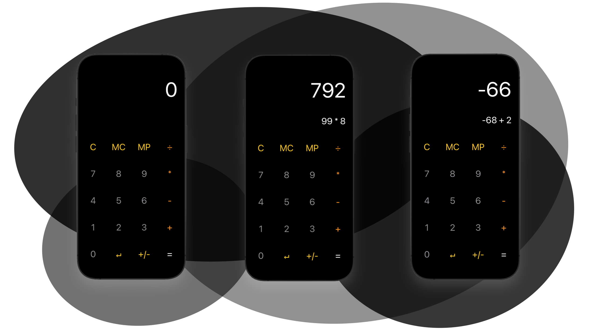
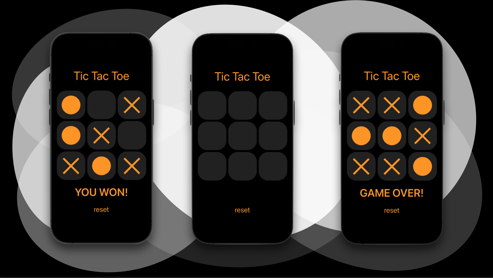
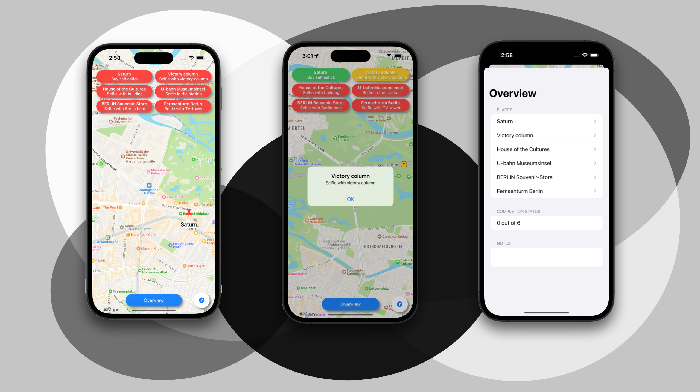

# Application development for IOS devices (Anwendungsentwicklung für IOS-Geräte) at Berliner Hochschule für Technik (BHT)
## Media Computer Science/Medieninformatik B.Sc.

I attended the "Application development for IOS devices" course with Prof. Dr. Dragan Macos, in the winter semester of 2022/2023. 
Throughout the course, we were challenged with small Swift App programming exercises that covered the fundamentals of swift and swiftUI.

The first project was to create a Prefix calculator (PraefixRechner Project). Then we should make a small one player Tic-Tac-Toe game (TicTacToe). At the end of ther semester, we should create a To-Do App with a Map which uses CoreLocation to track the user and set reminders off when entering the location of the list (KaisersWegpunkte).

Below are sample images of the Apps created.

